# **PowerVS Prerequisites**
----------------------

##	Create an IBM Cloud account.

If you don’t already have one, you need a paid IBM Cloud account to create your Power Systems Virtual Server instance.
To create an account, go to: [cloud.ibm.com](https://cloud.ibm.com).

##	Create an IBM Cloud account API key

Please refer to the following [documentation](https://cloud.ibm.com/docs/account?topic=account-userapikey) to create an API key.


## Create Power Systems Virtual Server Service Instance

After you have an active IBM Cloud account, you can create a Power Systems Virtual Server service. To do so, perform the following steps:

1. Log in to the IBM Cloud [dashboard](https://cloud.ibm.com/) and search for **Power** in the catalog.
&nbsp;
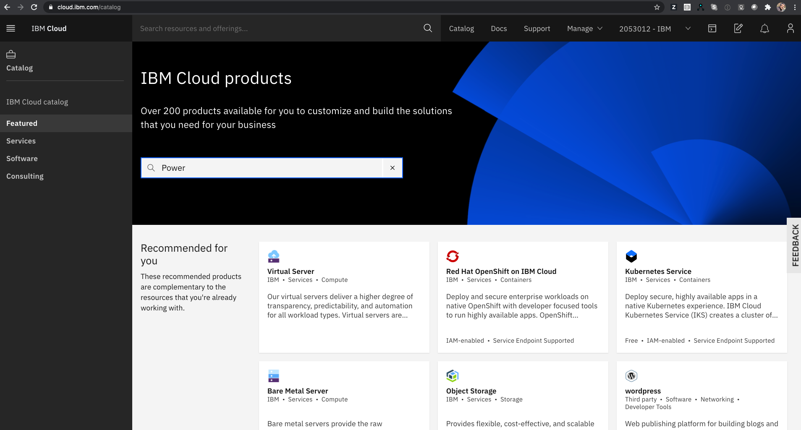
&nbsp;
2. Select **Power Systems Virtual Server**
&nbsp;
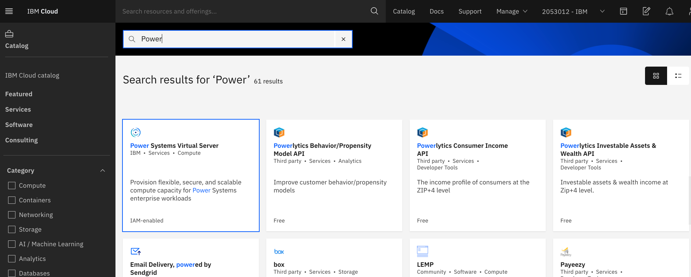
&nbsp;
3. Fill required details
&nbsp;
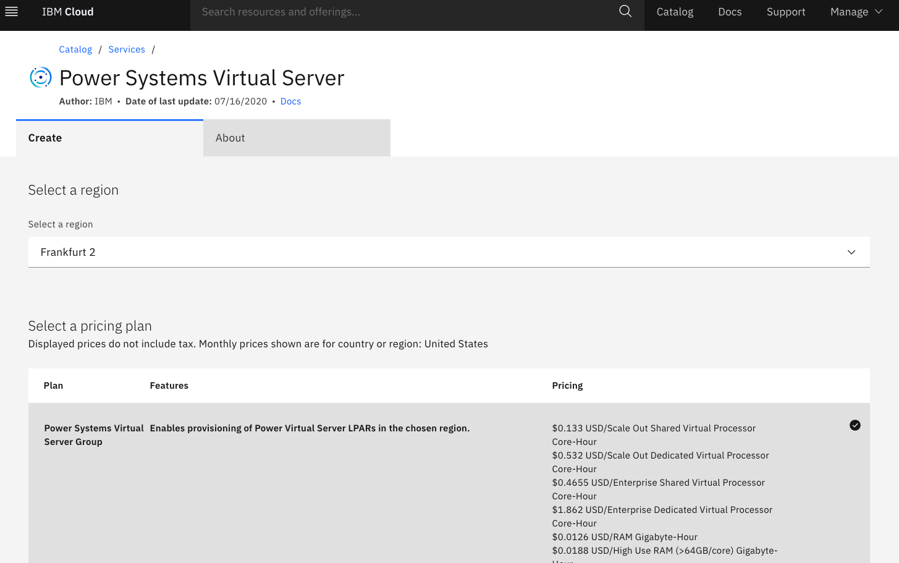
&nbsp;
Provide a meaningful name for your instance in the **Service name** field and select the proper **resource group**.
More details on resource groups is available from the following [link](https://cloud.ibm.com/docs/account?topic=account-rgs)
&nbsp;
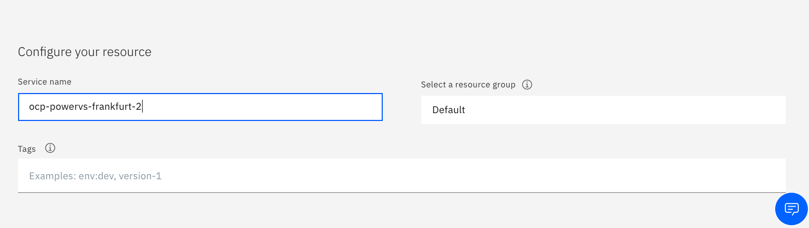
&nbsp;
4. Create Service
Click on "**Create**" to create the service instance.
&nbsp;
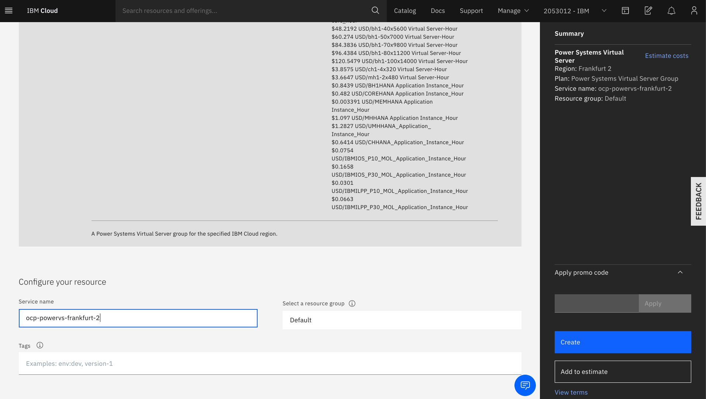
&nbsp;
## Create Private Network

A private network is required for your OpenShift cluster. Perform the following steps to create a private network for the Power Systems Virtual Server service instance created in the previous step.

1. Select the previously created "**Service Instance**" and create a private subnet by clicking "**Subnets**" and providing the required inputs.
&nbsp;
**Note:** If you see a screen displaying CRN and GUID, then click "View full details" to access the "Subnet" creation page.
&nbsp;

&nbsp;
2. Provide the network details and click **"Create subnet"**
&nbsp;
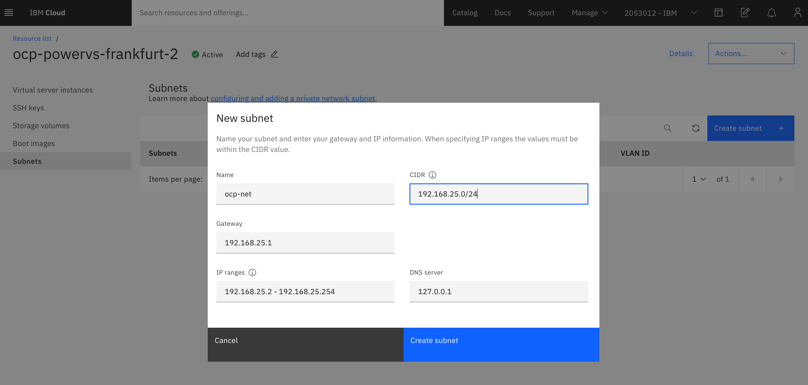
&nbsp;
On successful network creation, the following output will be displayed in the dashboard.
&nbsp;
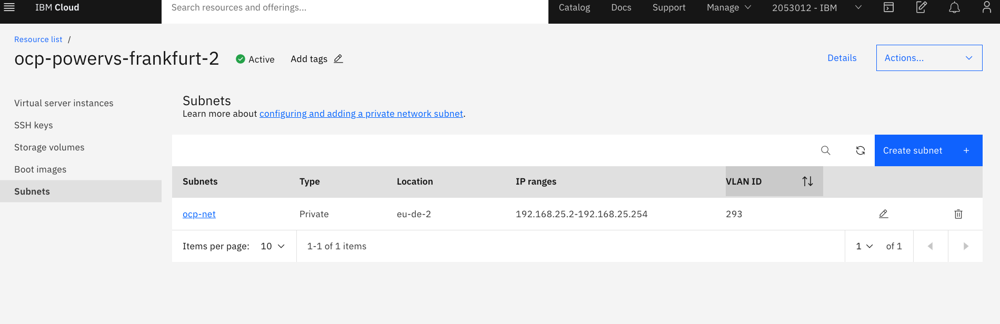

### Enable communication over the private network

Two options are available to enable communication over the private network.

*Option 1*

You can use the IBM Cloud CLI with the latest power-iaas plug-in (version 0.3.4 or later) to enable a private network communication.
Refer: https://cloud.ibm.com/docs/power-iaas?topic=power-iaas-managing-cloud-connections

This requires attaching the private network to an IBM Cloud Direct Link Connect 2.0 connection.
Perform the following steps to enable private network communication by attaching to the Direct Link Connect 2.0 connection.

- Select a specific service instance
You’ll need the CRN of the service instance created earlier (for example, ocp-powervs-test-1).

```
ibmcloud pi service-target crn:v1:bluemix:public:power-iaas:tok04:a/65b64c1f1c29460e8c2e4bbfbd893c2c:e4bb3d9d-a37c-4b1f-a923-4537c0c8beb3::
```

- Get the ID of the private network
```
ibmcloud pi nets | grep -w ocp-net


ID           93cc386a-53c5-4aef-9882-4294025c5e1f
Name         ocp-net
Type         vlan
VLAN         413
CIDR Block   192.168.201.0/24
IP Range     [192.168.201.2  192.168.201.254]
Gateway      192.168.201.1
DNS          127.0.0.1

```

You’ll need the ID in subsequent steps.

- Get the Direct Link Connect connection ID
```
ibmcloud pi cons

ID                                     Name             Link Status   Speed
89fcfd7c-ec74-473b-ba09-4cd95fa47e2e   ocp-powervs-dl   idle          10000

```

Get the ID of the connection.

If you don’t have an existing Direct Link Connect 2.0 connection provisioned under your account,
then you can create a new connection using the IBM Cloud CLI.
A highly available Direct Link Connect 2.0 connection between the Power Virtual Server and IBM Cloud comes free of cost.
Refer: https://cloud.ibm.com/docs/power-iaas?topic=power-iaas-ordering-direct-link-connect

```
ibmcloud pi conc ocp-powervs-dl --speed 10000
```

- Attach the private network to Direct Link Connect 2.0 (connection)
```
ibmcloud pi conan 89fcfd7c-ec74-473b-ba09-4cd95fa47e2e --network e1b90247-a504-4468-8662-8f785533067d
```

This can take 3 to 5 minutes to become active.

- Verify the status of the attachment
```
ibmcloud pi con 89fcfd7c-ec74-473b-ba09-4cd95fa47e2e

ID               89fcfd7c-ec74-473b-ba09-4cd95fa47e2e
Name             ocp-powervs-dl
Link Status      idle
Speed            10000
Creation Date    2021-05-13T13:17:08.093Z
Global Routing   false
IBM IPAddress    169.254.0.1/30
User IPAddress   169.254.0.2/30
Metered          false
Classic          false
Networks         ID: e1b90247-a504-4468-8662-8f785533067d       Name: ocp-net  VlanID: 392

```

The output shows that the `ocp-net` private network is attached to Direct Link Connect 2.0.
This enables inter VM communication on the private network as well as communication with IBM Cloud over Direct Link.

*Option 2*


If you don’t want to use Direct Link, then you’ll need to raise a service request to enable private network communication.

Perform the following steps to raise the service request.

Click on **Support** in the top bar of the dashboard and scroll down to **Contact Support**, then select "**Create a case**"
&nbsp;
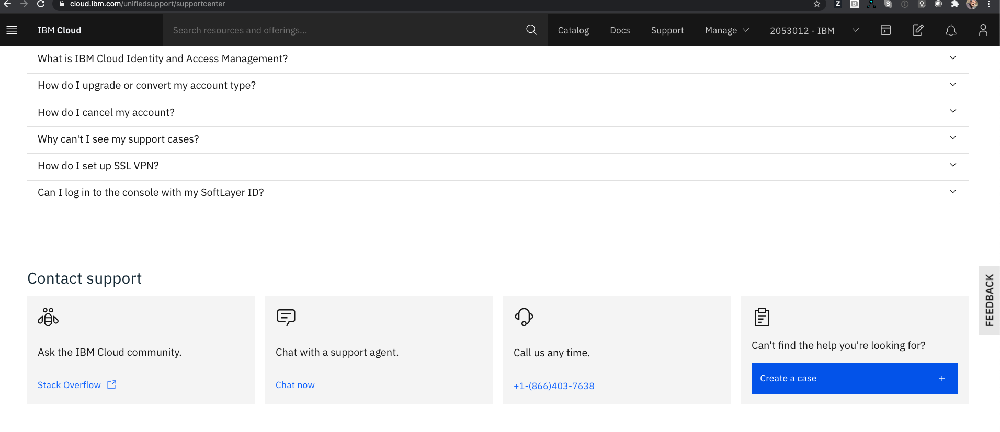
&nbsp;
Select "**Power Systems Virtual Server**" tile
&nbsp;
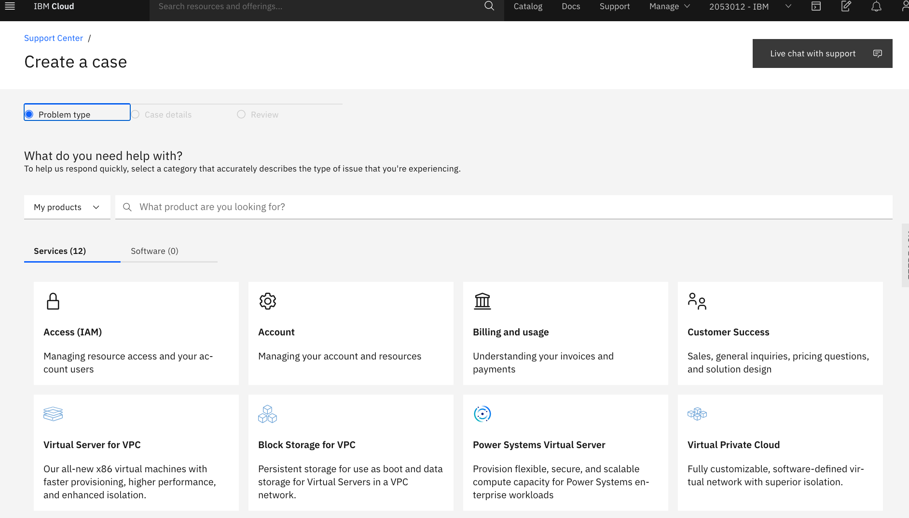
&nbsp;
Complete the details as shown using the following template:
&nbsp;
- [Subject:] Enable communication between PowerVS instances on private network
- [Body:]
  ```
    Please enable IP communication between PowerVS instances for the following private network:
    Name: <your-subnet-name-from-above>
    Type: Private
    CIDR: <your ip subnet-from-above>
    VLAN ID: <your-vlan-id> (listed in your subnet details post-creation)
    Location: <your-location> (listed in your subnet details post-creation)
    Service Instance: <your-service-name>
  ```
&nbsp;
Following is a complete example of the support case content.
```
  Please enable IP communication between PowerVS instances for the following private network:
  Name: ocp-net
  Type: Private
  CIDR: 192.168.25.0/24
  VLAN ID: 293
  Location: eu-de-2
  Service Instance: ocp-powervs-frankfurt-2
```
&nbsp;
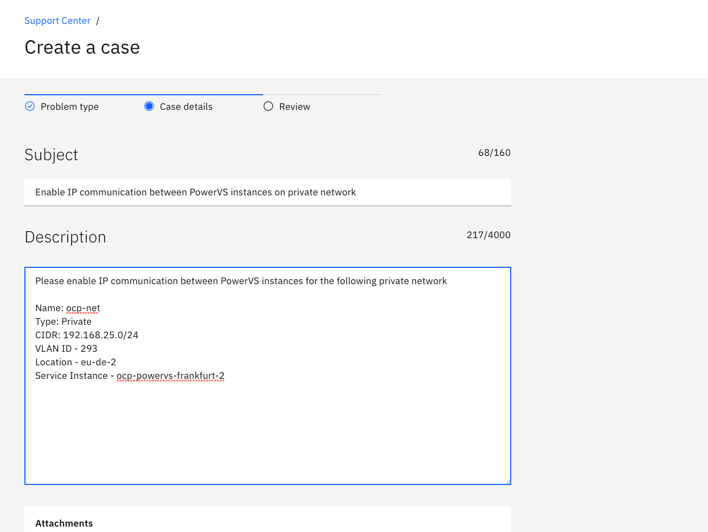
&nbsp;
Click "**Continue**" to accept agreements, and then Click "**Submit case**".
&nbsp;
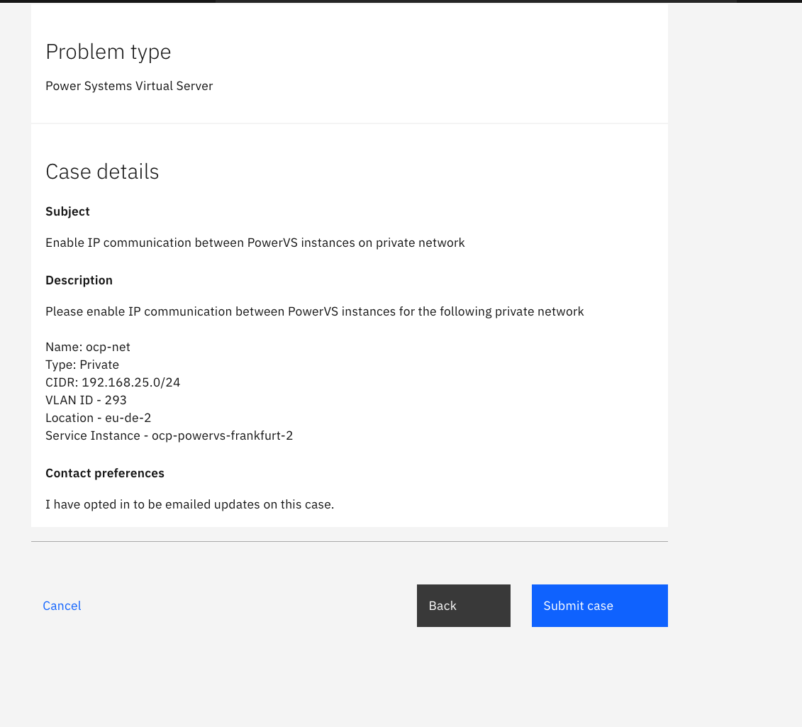
&nbsp;

This usually takes a day to get enabled.

## RHCOS and RHEL/CentOS 8.X Images for OpenShift
RHEL image is used for bastion and RHCOS is used for the OpenShift cluster nodes.

You'll need to create [OVA](https://en.wikipedia.org/wiki/Open_Virtualization_Format) formatted images for RHEL and RHCOS, upload them to IBM Cloud Object storage and then import these images as boot images in your PowerVS service instance.

Further, the image disk should be minimum of 120 GB in size.

### Creating OVA images

- If you have PowerVC then you can follow the instructions provided in the [link](https://www.ibm.com/support/knowledgecenter/en/SSXK2N_1.4.4/com.ibm.powervc.standard.help.doc/powervc_export_image_hmc.html) to export an existing PowerVC image to OVA image.
- You can also use the following [tool](https://github.com/ppc64le-cloud/pvsadm) to convert Qcow2 image to OVA.
- Qcow2 Image Links
  - RHEL 8.3 Qcow2 image is available from the following [link](https://access.redhat.com/downloads/content/279/ver=/rhel---8/8.3/ppc64le/product-software)
  - CentOS 8.3 Wcow2 image is available from the following [link](https://cloud.centos.org/centos/8/ppc64le/images/CentOS-8-GenericCloud-8.3.2011-20201204.2.ppc64le.qcow2)
  - RHCOS Qcow2 image is available from the following [link](https://mirror.openshift.com/pub/openshift-v4/ppc64le/dependencies/rhcos/4.11/latest/rhcos-openstack.ppc64le.qcow2.gz)

Note: RHCOS image version is tied to the specific OCP release. For example RHCOS-4.11 image needs to be used for OCP 4.11 release.
### Uploading to IBM Cloud Object Storage

- **Create IBM Cloud Object Storage service and bucket**
Please refer to the following [link](https://cloud.ibm.com/docs/cloud-object-storage?topic=cloud-object-storage-getting-started-cloud-object-storage) for instructions to create IBM Cloud Object Storage service and required storage bucket to upload the OVA images.
&nbsp;
- **Create secret and access keys with Hash-based Message Authentication Code (HMAC)**
Please refer to the following [link](https://cloud.ibm.com/docs/cloud-object-storage?topic=cloud-object-storage-uhc-hmac-credentials-main) for instructions to create the keys required for importing the images into your PowerVS service instance.
&nbsp;
- **Upload the OVA image to Cloud Object storage bucket**
Please refer to the following [link](https://cloud.ibm.com/docs/cloud-object-storage?topic=cloud-object-storage-upload) for uploading the OVA image to the respective bucket. Alternatively you can also use the following [tool](https://github.com/ppc64le-cloud/pvsadm).


### Importing the images in PowerVS

Choose the previously created PowerVS **"Service Instance"**, click **"View full details"** and select **"Boot images"**.
Click the **"Import image"** option and fill the requisite details like image name, storage type and cloud object storage details.

Example screenshot showing import of RHEL image that is used for bastion
&nbsp;
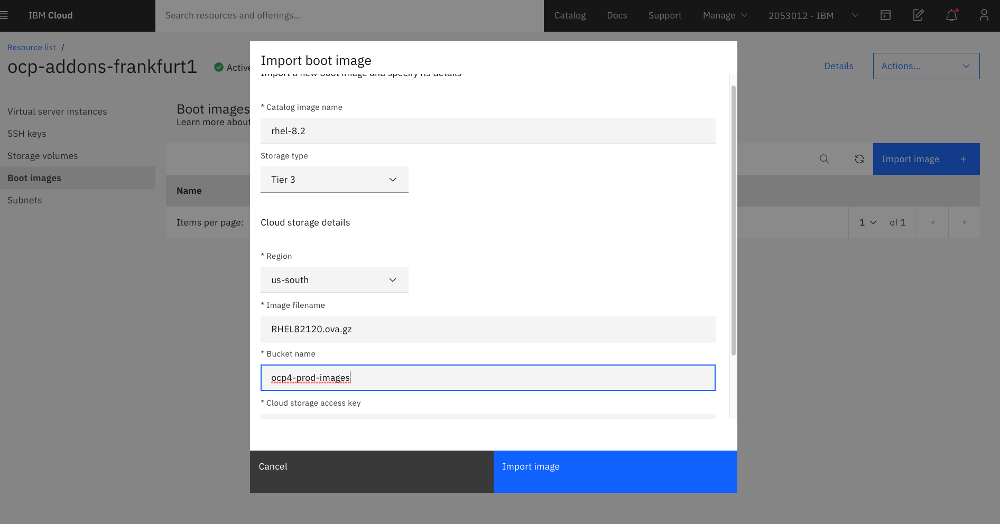
&nbsp;
Example screenshot showing import of RHCOS image used for OCP
&nbsp;

&nbsp;

Your PowerVS service instance is now ready for OpenShift clusters.
